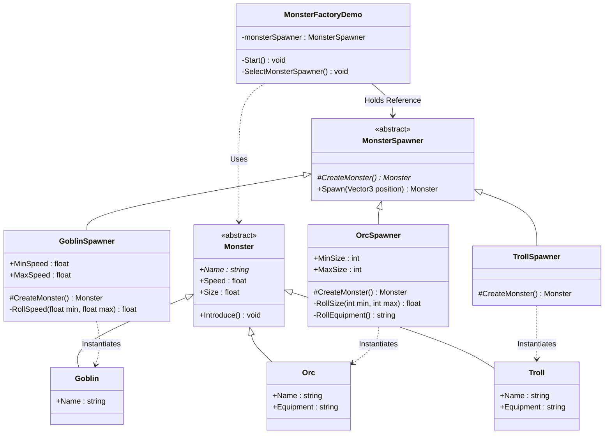



```mermaid
classDiagram
    class Monster {
        <<abstract>>
        +Name : string*
        +Speed : float
        +Size : float
        +Introduce() void
    }

    class Goblin {
        +Name : string
    }
    Monster <|-- Goblin

    class Orc {
        +Name : string
        +Equipment : string
    }
    Monster <|-- Orc

    class Troll {
        +Name : string
        +Equipment : string
    }
    Monster <|-- Troll

    class MonsterSpawner {
        <<abstract>>
        #CreateMonster()* Monster
        +Spawn(Vector3 position) Monster
    }

    class GoblinSpawner {
        +MinSpeed : float
        +MaxSpeed : float
        #CreateMonster() Monster
        -RollSpeed(float min, float max) float
    }
    MonsterSpawner <|-- GoblinSpawner
    GoblinSpawner ..> Goblin : Instantiates

    class OrcSpawner {
        +MinSize : int
        +MaxSize : int
        #CreateMonster() Monster
        -RollSize(int min, int max) float
        -RollEquipment() string
    }
    MonsterSpawner <|-- OrcSpawner
    OrcSpawner ..> Orc : Instantiates

    class TrollSpawner {
        #CreateMonster() Monster
    }
    MonsterSpawner <|-- TrollSpawner
    TrollSpawner ..> Troll : Instantiates

    class MonsterFactoryDemo {
        -monsterSpawner : MonsterSpawner
        -Start() void
        -SelectMonsterSpawner() void
    }
    MonsterFactoryDemo --> MonsterSpawner : Holds Reference
    MonsterFactoryDemo ..> Monster : Uses

```

